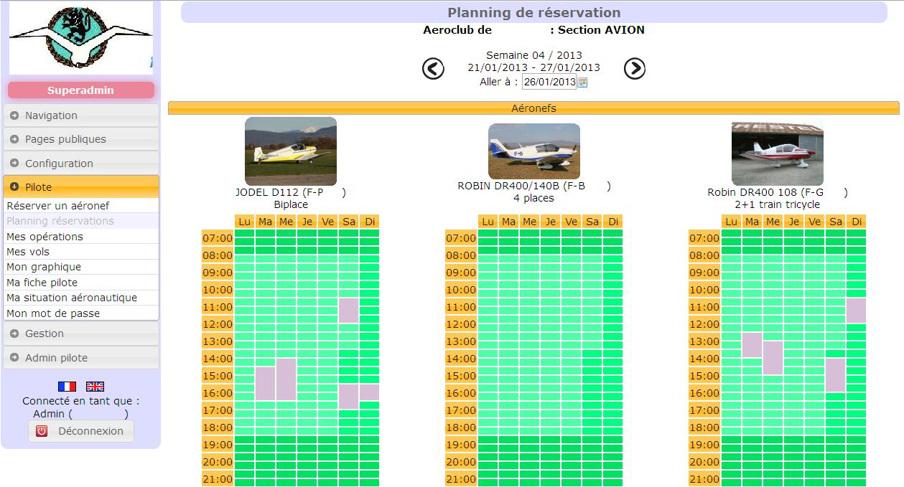
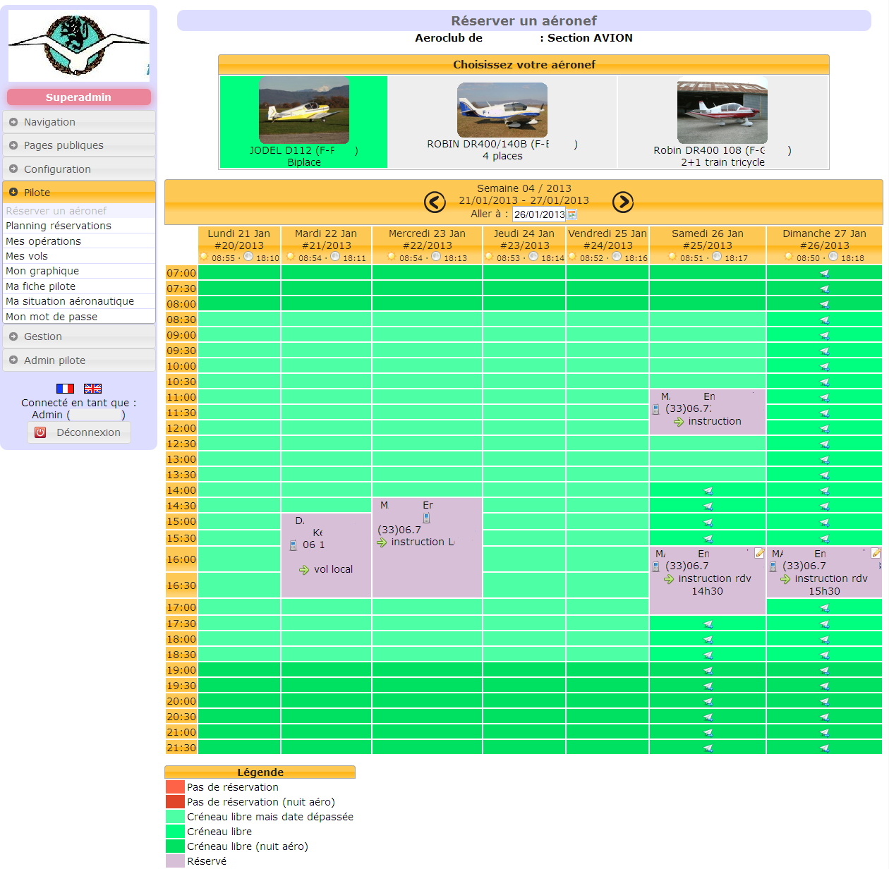

## Galette plugin Aéroclub

Galette Aéroclub est un plugin réalise pour Galette permettant la gestion de base d'un Aéroclub.

* Réservation d'un aéronef
* Suivi de ses opérations (coûts liés à la location de l'aéronef)
* Liste des vols et graphique des heures de vols 

Pour les gestionnaires de l'aéroclub :

* Consultation des soldes des pilotes
* Graphiques des heures de vols des pilotes et aéronefs
* Graphiques des types de vols des pilotes 

Pour l'administrateur du site :

* Gestion des aéronefs
* Gestion des instructeurs
* Rapprochement des réservations
* Paramétrage application (coordonnées de l'aéroclub pour la nuit aéro, jours réservables, jours de non réservation des aéronefs) 

### Captures écrans

Graphique des heures de vols d'un aéronefs (vue réservée aux gestionnaires)

Planning de vol des aéronefs

Calendrier de réservation d'un aéronef

Graphique pour un pilote récapitulant son solde (€), et ses heures de vols (par mois et cumulé)

Vue du récapitulatifs des vols d'un membre, trié par date

Export en PDF pour impression du récapitulatifs des vols du membre

