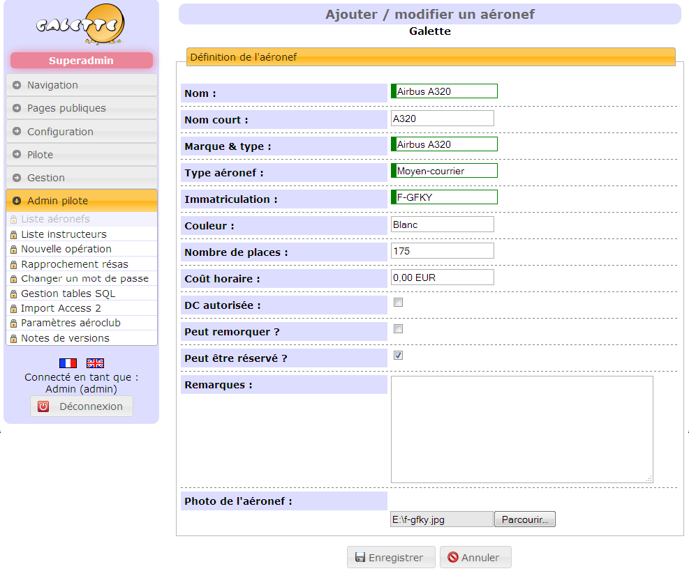
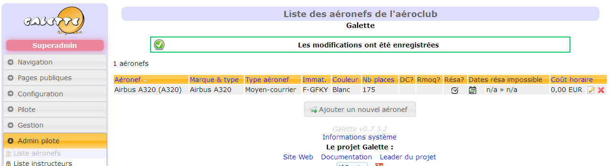
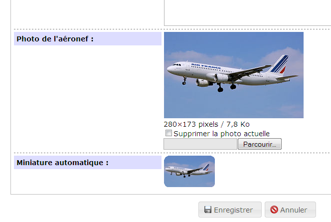
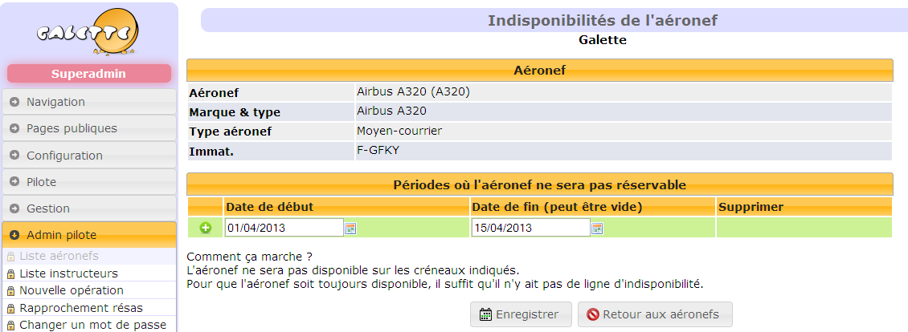
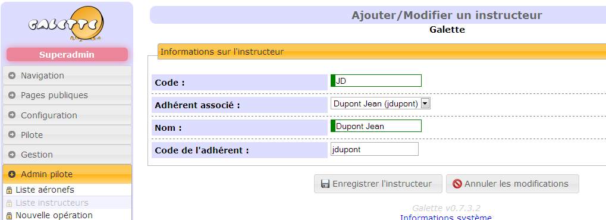

## Installation

S'agissant d'un plugin pour [Galette](https://galette.eu), vous devez obligatoirement avoir installé préablement un serveur avec Galette en version 0.7.3 minimum.

Dézippez l'archive dans le répertoire plugins de Galette.

Rendez vous sur la page de configuration des plugins, comme décrit [dans la documentation Galette](https://galette.eu/documentation/fr/plugins/index.html), activez le plugin _Aéroclub (Pilote)_ si ce n'est pas fait, et lancez la procédure de création des tables SQL.

Vous devriez avoir 9 nouvelles tables dans la base de données :

* `galette_pilote_adherent_complement` : stocke les informations complémetaires du pilote (n° de license, date dernier vol, pilote élève, etc.)
* `galette_pilote_avions` : stocke la liste des aéronefs de l'aéroclub
* `galette_pilote_avions_dispo` : comme son nom ne l'indique pas, stocke les périodes où un aéronef ne peut pas être réservé
* `galette_pilote_instructeurs` : stocke la liste des instructeurs de l'aéroclub
* `galette_pilote_operations` : stocke les opérations des pilotes (montant négatif pour un vol, montant positif quand il renfloue son compte)
* `galette_pilote_parametres` : stocke les paramètre applicatifs du plugin
* `galette_pilote_pictures` : stocke les photos des aéronefs
* `galette_pilote_reservations` : stocke la liste des réservations des aéronefs par les pilotes
* `galette_pilote_sql_scripts` : stocke l'exécution des scripts SQL de mise à jour du plugin (non utilisé généralement)

ainsi que 15 nouveaux paramètres dans la table `galette_pilote_parametres`.

## Configuration

* Pour commencer, vous devez [ajouter des aéronefs](#créer--modifier-un-aéronef).
* Ensuite si nécessaire, [ajoutez des instructeurs](#créer--modifier-des-instructeurs).
* Enfin, modifiez les [paramètres](parametrage) pour les adapter à votre aéroclub.

## Créer / modifier un aéronef

Allez sur la page **_Liste aéronefs_** et cliquez sur le bouton **_Ajouter un nouvel aéronef**_.

Les champs marqués en rouge sont obligatoires et seront visibles des pilotes depuis la réservation ou le planing des aéronefs. Les autres champs sont facultatifs.

N'oubliez pas de cocher la case **Peut être réservé ?** sinon votre aéronef ne pourra pas être réservé du tout.

Choisissez une photo (pour maximiser la réussite du téléchargement du fichier, utilisez un nom de fichier sans espaces ni caractères accentés, idéalement en minuscules) de l'aéronef et cliquez sur **Enregistrer**.

Votre aéronef est prêt.

Vous pouvez cliquer sur le bouton d'édition de l'aéronef pour vérifier que la photo a bien été téléchargée. Si la photo est présente, la miniature utilisée pour la réservation et le planning sera créée automatiquement et visible.

### Périodes d'indisponibilité d'un aéronef

Si un aéronef ne devait pas être disponible pour une période donnée (prêt à un autre aéroclub, réparation, etc.), cliquez sur le bouton "disponibilités" depuis la liste des aéronefs pour définir une période d'indisponibilité de l'aéronef.

Là, vous pouvez définir la plage de date pour laquelle l'aéronef ne pourra pas être réservé. 

Si vous ne remplissez pas la date de fin, l'aéronef ne pourra pas être réservé à partir de la date de début, ad vitam eternam.

## Créer / modifier des instructeurs

Un instructeur a un statut particulier dans le plugin aéroclub. Il a en effet la possibilité de créer des réservations pour des élèves ainsi que de modifier ces réservations.

Il peut aussi voir les graphiques d'utilisation des avions et des pilotes.

Ouvrez la page _**"Liste instructeurs"**_, puis cliquez sur _**"Ajouter un instructeur"**_. 

Sélectionnez dans la liste déroulante l'adhérent associé pour que l'instructeur soit un membre de Galette. Sinon laissez _"extérieur"_ pour un intervenant extérieur non enregistré dans Galette :

C'est bon, quand l'adhérent sélectionné se connectera, il aura accès aux fonctionnalités réservées aux instructeurs.
